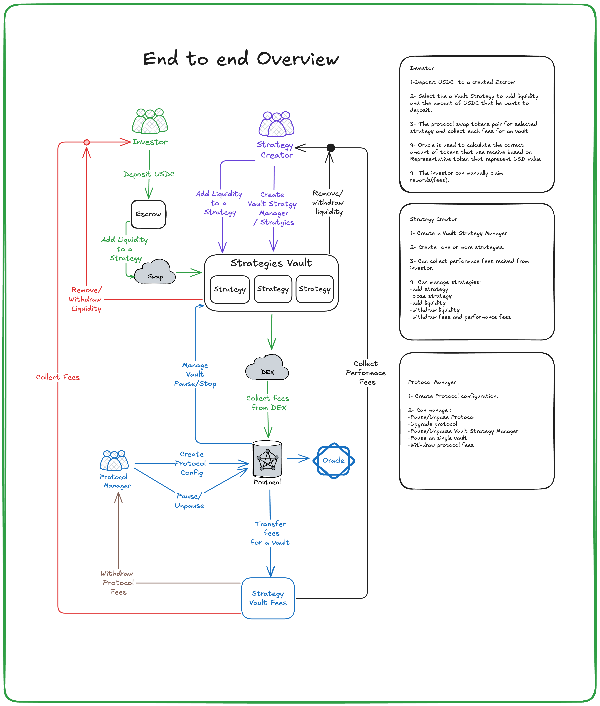

# Tokenized Multi-Strategy Vault

Tokenized Multi-Strategy Vault is a Solana program designed to engage a social layer of investors seeking maximum capital efficiency. It enables users to earn yield by providing liquidity to AMMs across various Web3 protocols. Investors can join the vaults using a single asset, such as stablecoins or SOL.

# Architecture Design

This document provides an overview of the architecture for the Tokenized Multi-Strategy Vault.

[Architecture Design](docs/Architecture-Design.pdf)

## End-to-End Diagram

## Technologies
- **Solana**
- **Rust**
- **Typescript**
